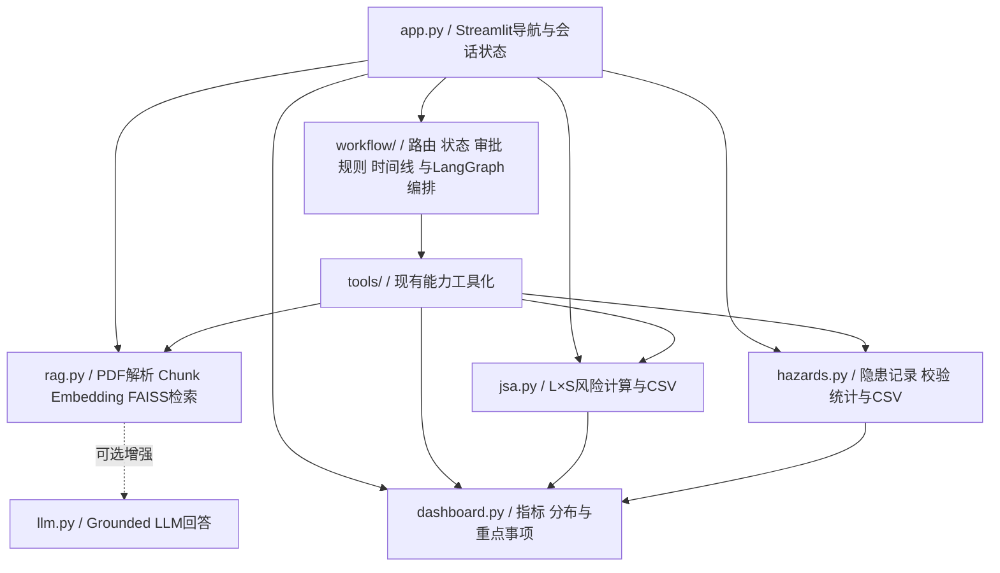

# EHS Copilot

## AI辅助EHS风险与危化品管理平台

面向制造业EHS场景的轻量数字化原型，集成SDS语义检索、JSA风险评估、隐患整改闭环及EHS数据看板。

## 在线体验

**Live Demo：** <https://ehs-copilot-zgiwyfrlcygmh58qcjp6lb.streamlit.app/>

公开Demo无需API Key。首次打开时会自动加载仓库内置的中英双语Synthetic SDS；访客也可以上传自己的多份可复制文本PDF。

## 核心功能

### 1. SDS智能检索

- 构建多PDF SDS知识库；
- 支持中文、英文自然语言查询；
- 覆盖危险性、PPE、储存、急救、泄漏及消防场景；
- 使用HuggingFace Embeddings与FAISS进行语义检索；
- 显示来源文件、PDF物理页码和原文证据；
- 证据不足时明确提示当前SDS知识库中未找到相关信息。

### 2. JSA风险评估

- 记录作业步骤、危险源、可能后果及控制措施；
- 按 `R = L × S` 计算初始风险和残余风险；
- 显示低、中、高、重大四级风险；
- 支持当前会话内多条记录管理、删除、清空及CSV导出。

### 3. 隐患整改管理

- 新增、编辑和删除隐患记录；
- 记录风险等级、责任人、发现日期、整改期限及整改措施；
- 管理待整改、整改中、已关闭三种状态；
- 自动计算整改完成率并支持CSV导出；
- 内置8条明确标注的模拟EHS隐患数据用于功能演示。

### 4. EHS仪表盘

- 汇总JSA高/重大风险数量、JSA记录总数和隐患总数；
- 显示待整改、已关闭数量及整改完成率；
- 展示JSA风险、隐患风险、隐患类型和整改状态分布；
- 列出少量高/重大风险JSA及高/重大且未关闭隐患；
- 直接读取JSA与隐患模块的当前会话数据，页面刷新后同步变化。

### 5. AI工作流助手（V3）

- 统一任务入口：用一句自然语言描述任务，无需先选功能页；
- LangGraph 状态机编排：`route → plan → guard_plan → tools → screen_evidence → summarize`；
- 规则路由识别 SDS 查询、JSA 风险评估、隐患管理、仪表盘汇总及它们的组合任务；
- 将现有能力工具化为 `search_sds`、`calculate_risk`、`draft_jsa`、`create_hazard`、`update_hazard`、`get_dashboard_summary`；
- 页面完整展示：识别出的任务类型、计划调用的工具、当前执行步骤、工具执行结果与最终回答；
- 自动生成的 JSA 与隐患记录会写回当前会话，与对应页面实时一致（均标注为草稿，需人工确认）。

#### 5.1 Human-in-the-loop（人工确认）

使用 LangGraph 原生 `interrupt()` + Checkpointer：需要确认时图会**暂停并落检查点**，暂停点之前的节点不会重跑，因此写操作绝不可能执行两次。

以下操作必须暂停等待人工确认：

- 创建隐患、修改隐患、关闭隐患；
- 涉及重大风险的写操作；
- AI 建议降低风险等级；
- SDS 证据不足或来源冲突时继续使用结论。

操作员可以 **批准** / **修改参数后批准** / **拒绝**：

- 批准 → 用原参数继续；
- 修改 → 用修改后的参数继续（只能改参数，不能换工具；任何会把重大风险、降低风险等级、关闭隐患等**新审批项**引入的修改会被按拒绝处理，需重新发起任务）；
- 拒绝 → 流程立即停止，不执行任何工具调用。

> 说明：`run_workflow()` 的 `auto_approve` 默认为 `True`，用于保持第一阶段的程序化调用语义；**Streamlit 页面始终传 `auto_approve=False`**，即真实使用路径一定经过人工审批。

#### 5.2 Guardrail（安全规则）

| 规则 | 等级 | 说明 |
| --- | --- | --- |
| SDS 结论必须有文件名、页码与原文证据 | 需审批 | 缺任一项即暂停；无人确认时一律阻断 |
| 风险分值必须由现有代码计算 | 阻断 | 计划不得携带预置分值，返回的分值会用 `jsa.calculate_risk` 复算（含残余风险），不一致即丢弃 |
| 化学品与 SDS 不匹配 | 阻断 | 问题点名的化学品不在已加载 SDS 覆盖范围内时，停止该 SDS 结论 |
| SDS 来源冲突 | 需审批 | 同一章节命中多个不同来源文件时必须人工确认以哪份为准 |
| 写操作必须经过审批 | 需审批 | 见 5.1 |
| 紧急事件必须遵循企业应急预案 | 提示 | 识别到进行中的泄漏/火灾/中毒等事件时，提示按应急预案与专业人员指挥处置并拨打 119/120 |

#### 5.3 执行时间线（Workflow Timeline）

页面以时间线呈现：已识别任务 → 已生成计划 → 等待审批 / 已批准 / 已拒绝 → 已调用工具 → 已获取证据 → 当前风险等级 → 已生成 JSA → 已执行写操作 → 已完成。暂停时「等待审批」始终是最后一个事件；被拒绝/被阻断时终点会标注为对应状态。


## 技术栈

- Python
- Streamlit
- HuggingFace Embeddings / Sentence Transformers
- FAISS
- LangChain
- LangGraph（V3 工作流编排）
- pypdf
- OpenAI-compatible Chat API（可选）

## 项目架构



`workflow/` 内部结构：

| 模块 | 职责 |
| --- | --- |
| `router.py` | 规则路由：任务识别、参数抽取、工具计划 |
| `state.py` | 图状态与结果对象（含审批、规则命中、时间线） |
| `hitl.py` | 审批请求/决策对象（批准 / 修改 / 拒绝） |
| `guardrails.py` | 纯函数式安全规则（证据、分值、化学品、紧急事件） |
| `timeline.py` | 由状态派生的执行时间线 |
| `graph.py` | LangGraph 编排与 `interrupt()` 暂停/恢复 |
| `summary.py` | 确定性回答合成 |
| `ui.py` | 「AI 工作流助手」页面 |

工具层只是薄包装：风险计算、记录校验、指标聚合等业务逻辑仍保留在 `jsa.py`、`hazards.py`、`dashboard.py`、`rag.py` 中，`workflow/` 与 `tools/` 不复制这些逻辑。安全规则也**不自己算分**——风险分值一律由 `jsa.calculate_risk` 产生，再用同一函数复算校验。

核心业务数据仅保存在当前Streamlit会话中，不使用数据库。Dashboard直接读取 `jsa_records` 和 `hazard_records`，不维护独立副本。

## 本地运行

```powershell
git clone https://github.com/qingxiangliu85-netizen/ehs-copilot.git
cd ehs-copilot
python -m venv .venv
.\.venv\Scripts\Activate.ps1
python -m pip install -r requirements.txt
python -m streamlit run app.py
```

浏览器访问：<http://localhost:8501/>

首次构建SDS知识库时需要从HuggingFace下载Embedding模型，冷启动时间取决于网络和本地缓存。

## Optional LLM Enhancement

默认公开Demo使用免费SDS检索模式，不需要API Key。若需要本地启用基于检索证据的LLM回答，可将 `.env.example` 复制为 `.env`：

```dotenv
OPENAI_API_KEY=your-api-key-here
OPENAI_BASE_URL=
OPENAI_MODEL=gpt-4o-mini
```

`.env` 已被Git忽略。禁止将真实密钥提交到仓库、README或日志。

## 测试

当前自动化测试覆盖SDS/RAG、Demo体验、JSA、隐患整改、仪表盘计算，以及V3工作流（路由/工具调用/LangGraph编排/新页面/Human-in-the-loop/Guardrail/时间线）：**91/91 passed**。

```powershell
python -m unittest discover -s tests -p "test_*.py" -v
```

测试和Demo中的SDS、JSA及隐患数据均为模拟数据，不代表真实企业记录或真实作业SOP。

## Streamlit Community Cloud部署

1. 将仓库推送至GitHub；
2. 在Streamlit Community Cloud创建应用并选择该仓库；
3. Main file path填写 `app.py`；
4. 默认免费检索模式无需配置Secrets，重新部署即可。

## Disclaimer

本项目是EHS数字化原型及求职展示项目，不是企业生产级EHS系统。

- 示例SDS、JSA和隐患记录均为模拟数据；
- AI或语义检索结果不构成安全操作指令或自动决策；
- 本工具不替代企业制度、SOP、原始SDS、现场风险评估及专业人员判断；
- 实际作业、风险分级和整改措施必须依据适用法规、企业制度及现场条件确定；
- 请勿上传企业内部资料、员工个人信息或其他受限文件。

**This project is an AI-assisted EHS information retrieval and management prototype. It does not replace original SDS documents, site-specific procedures, workplace risk assessments, or professional EHS judgment.**

## License

项目自有代码采用 [MIT License](LICENSE)。第三方依赖受各自许可证约束，详见 [THIRD_PARTY_NOTICES.md](THIRD_PARTY_NOTICES.md)。
