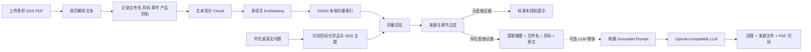

# EHS Copilot

> AI × EHS 危化品 SDS 智能检索助手 · v0.1

EHS Copilot 是一个可免费运行的 SDS 语义检索 Demo。无需 API Key，页面首次打开时会自动加载仓库自带的中英双语 Synthetic SDS 并建立知识库；访客也可以上传自己的多份可复制文本 PDF。自然语言查询结果包含从检索文本中提取的摘要、来源文件、PDF 页码和原文证据。

> **Safety Notice**
>
> This project is an AI-assisted EHS information retrieval prototype. AI-generated responses do not replace original SDS documents, site-specific procedures, or professional EHS judgment.

## EHS 实际痛点

制造业和实验室往往同时使用多种化学品。SDS 数量多、篇幅长、版本分散，在日常查询或紧急情况下逐份打开文件并定位章节，会带来几个现实问题：

- 危险性、PPE、储存、急救和泄漏信息分散在不同章节；
- 多份 SDS 的相似措辞容易造成化学品混淆；
- 仅给出 AI 摘要而没有文件名和页码，难以复核；
- SDS 没有记载的信息，模型可能基于常识补充并形成无依据回答。

v0.1 聚焦一个最小闭环：**加载或上传 SDS → 建立本地索引 → 自然语言查询 → 提取最相关信息 → 显示原始来源**。

## 核心功能

- 同时上传多份 SDS PDF；
- 首次打开页面自动加载中英双语 Synthetic Demo SDS，六个示例问题直接可用；
- 按 PDF 物理页提取文本并保留文件名、页码和 SDS 章节元数据；
- 使用多语言 Sentence Transformer 生成 Embedding；
- 在本地构建 FAISS 向量索引；
- 支持中文和英文自然语言问题；
- 根据产品名称和标准 SDS 章节约束检索范围，降低多文档串源风险；
- 默认使用 HuggingFace Embeddings + FAISS，完全不需要 API Key；
- 从最高相关度 SDS 文本中提取摘要，不调用付费 API、不硬编码 Demo 答案；
- 展示来源文件、页码和原文片段，便于回到原始 SDS 复核；
- 可选启用 OpenAI-compatible LLM，且模型只能接收检索后的 SDS 上下文；
- 证据不足时返回：`当前 SDS 知识库中未找到相关信息。`；
- API Key 只从本地 `.env` 读取，不写入代码或仓库。

## RAG 工作流程



默认检索参数：`chunk_size=1000`、`chunk_overlap=150`、`top_k=5`。

## 技术栈

- Python 3.11+
- Streamlit
- LangChain
- pypdf
- HuggingFace Embeddings / Sentence Transformers
- FAISS CPU
- OpenAI-compatible Chat API（可选）
- python-dotenv

直接依赖及许可证信息见 [THIRD_PARTY_NOTICES.md](THIRD_PARTY_NOTICES.md)。

## 项目结构

```text
EHS-Copilot/
├── app.py                         # Streamlit 页面与会话状态
├── config.py                      # 环境变量和 RAG 参数
├── llm.py                         # OpenAI-compatible LLM 接口
├── rag.py                         # PDF、chunk、embedding、FAISS 和检索约束
├── requirements.txt
├── .env.example
├── .gitignore
├── LICENSE
├── THIRD_PARTY_NOTICES.md
├── data/
│   ├── demo_sds/                  # 自行生成的 Synthetic Demo SDS 及来源说明
│   └── faiss_index/.gitkeep
├── docs/screenshots/              # GitHub 展示图及截图清单
└── tests/
    ├── test_sds_scenarios.py      # 运行时生成模拟 SDS 的自动化测试
    └── TEST_RESULTS_v0.1.md
```

## 安装与启动

### 1. 获取代码

```bash
git clone <your-repository-url>
cd EHS-Copilot
```

### 2. 创建虚拟环境

Windows PowerShell：

```powershell
python -m venv .venv
.\.venv\Scripts\Activate.ps1
```

macOS / Linux：

```bash
python3 -m venv .venv
source .venv/bin/activate
```

### 3. 安装依赖

```bash
python -m pip install --upgrade pip
python -m pip install -r requirements.txt
```

首次建立知识库时会下载多语言 Embedding 模型。下载时间和磁盘占用取决于网络与 HuggingFace 缓存状态；完整依赖包含 PyTorch，Windows 全新环境安装可能需要数分钟并占用约 1 GB 以上空间。

### 4. 启动应用

```bash
python -m streamlit run app.py
```

访问：<http://localhost:8501/>

### 5. 使用流程

1. 打开页面后等待 Synthetic SDS 自动建库完成；也可以在侧栏上传一个或多个自己的 SDS PDF；
2. 上传自己的文件时，点击“构建 / 更新知识库”；
3. 等待 PDF 解析、Embedding 和 FAISS 索引完成；
4. 在聊天框输入问题；
5. 阅读提取摘要，并始终回到对应文件、页码和原文证据复核。

## Optional LLM Enhancement

公开 Demo 默认不需要 API Key，也不会调用付费 LLM。若希望在本地启用基于证据的自然语言回答，可复制 `.env.example` 为 `.env` 并配置：

```dotenv
OPENAI_API_KEY=your-api-key-here
OPENAI_BASE_URL=
OPENAI_MODEL=gpt-4o-mini
```

`OPENAI_BASE_URL` 可留空；使用 OpenAI-compatible 服务时再填写对应接口地址。`.env` 已被 Git 忽略，禁止提交真实密钥。

## 部署到 Streamlit Community Cloud

1. 将仓库公开推送到 GitHub；
2. 在 Streamlit Community Cloud 选择 **Create app** 并连接该仓库；
3. Main file path 填写 `app.py`，无需配置 Secrets，直接部署即可。

首次加载 Demo 时需要下载 HuggingFace Embedding 模型，因此冷启动可能需要一些时间。

## 示例问题

```text
主要危险性是什么？
操作需要哪些 PPE？
皮肤接触后如何处理？
应该如何储存？
泄漏时采取什么措施？
火灾时使用什么灭火介质？
```

如果问题对应的信息未出现在 SDS 中，系统会明确提示知识库中未找到，而不是使用外部常识补充。

## 测试结果

v0.1 使用三份运行时生成的模拟 SDS 完成 **26 个场景问题**测试，共覆盖21个可核对文本页：

| 检查项 | 结果 |
|---|---:|
| 场景问题 | 26 / 26 通过 |
| PDF 解析与页码元数据 | 通过 |
| 危险性、PPE、储存和急救检索 | 通过 |
| 泄漏处置和消防措施检索 | 通过 |
| 中文与英文问题 | 通过 |
| 多 PDF 化学品隔离 | 通过 |
| Grounded Prompt 与引用一致性 | 通过 |
| 缺失章节和无关问题拒答 | 通过 |
| Demo SDS 六类示例问题 | 6 / 6 通过 |
| 首次打开 → Demo 自动建库 → 点击问题 → 中文摘要与证据 | 通过 |

运行测试：

```bash
python -m unittest tests.test_sds_scenarios -v
python -m unittest tests.test_demo_experience -v
```

测试 PDF 是程序生成的虚构 QA 材料，不是真实 SDS，不得用于实际操作。详细测试边界见 [tests/TEST_RESULTS_v0.1.md](tests/TEST_RESULTS_v0.1.md)。当前未配置真实 API Key 的环境只验证模型输入、检索、拒答和引用链路，不宣称已验证所有在线模型措辞。

## GitHub 展示截图

建议发布后补充不涉及密钥或真实 SDS 的界面截图：

1. 多 PDF 成功建库；
2. 正常回答与来源页码；
3. 无依据问题的标准拒答；
4. 一次英文查询。

完整截图要求见 [docs/screenshots/README.md](docs/screenshots/README.md)。不得使用版权状态不明确的真实 SDS 制作公开截图。

## Safety Limitations

本项目是求职作品和技术验证性质的 AI 辅助信息检索原型，不是生产级企业 EHS 系统。

- 回答可能受 PDF 文本质量、切分、Embedding、检索和模型能力影响；
- 来源页码是 PDF 文件物理页序，可能不同于文件中印刷的页码；
- 仅支持含可复制文字的 PDF，扫描件暂不支持 OCR；
- 非标准章节标题、无法识别产品名称或命名含糊的文件可能降低检索隔离效果；
- FAISS 索引保存在当前应用会话中，重启后需要重新构建；
- 系统不执行最终风险判定，不批准高风险作业，不生成现场应急决策；
- 任何实际操作都必须回到原始 SDS、现场条件、企业制度及专业 EHS 判断进行确认。

**This project is an AI-assisted EHS information retrieval prototype. AI-generated responses do not replace original SDS documents, site-specific procedures, or professional EHS judgment.**

## SDS 与隐私边界

- 仓库不包含真实厂商 SDS PDF，仅包含一份自行生成并明确标注的中英双语 Synthetic Demo SDS；
- 自动化测试只在临时目录生成模拟 PDF；
- `data/demo_sds/` 下的 PDF 默认被 `.gitignore` 排除；
- 不应上传企业内部 SDS、员工信息、实验室成员信息或其他受限材料；
- 如果无法确认某份 SDS 是否允许公开再分发，就不要提交该文件。

## Roadmap

v0.1 发布后仅考虑围绕当前 SDS 检索链路做质量改进：

- 使用经许可的公开 SDS 扩充回归测试；
- 评估扫描件 OCR 和更稳健的非标准章节识别；
- 增加可量化的检索评估指标与真实模型端到端测试；
- 评估索引持久化和更明确的回答置信度策略。

Dashboard、库存台账、登录、数据库和企业工作流不属于 v0.1 范围。

## License

项目自有代码采用 [MIT License](LICENSE)。第三方依赖仍分别受其自身许可证约束，详见 [THIRD_PARTY_NOTICES.md](THIRD_PARTY_NOTICES.md)。仓库未复制参考项目源码，也不声称第三方依赖代码为本项目原创。
