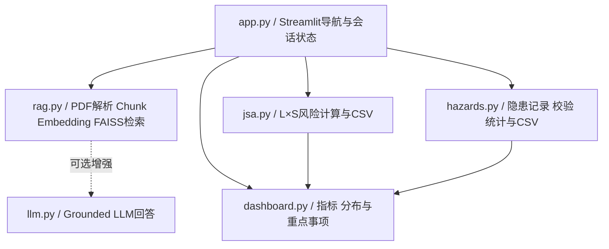

# EHS Copilot

## AI辅助EHS风险与危化品管理平台

面向制造业EHS场景的轻量数字化原型，集成SDS语义检索、JSA风险评估、隐患整改闭环及EHS数据看板。

## 在线体验

**Live Demo：** <https://ehs-copilot-zgiwyfrlcygmh58qcjp6lb.streamlit.app/>

公开Demo无需API Key。首次打开时会自动加载仓库内置的中英双语Synthetic SDS；访客也可以上传自己的多份可复制文本PDF。

## 核心功能

### 1. SDS智能检索

- 构建多PDF SDS知识库；
- 支持中文、英文自然语言查询；
- 覆盖危险性、PPE、储存、急救、泄漏及消防场景；
- 使用HuggingFace Embeddings与FAISS进行语义检索；
- 显示来源文件、PDF物理页码和原文证据；
- 证据不足时明确提示当前SDS知识库中未找到相关信息。

### 2. JSA风险评估

- 记录作业步骤、危险源、可能后果及控制措施；
- 按 `R = L × S` 计算初始风险和残余风险；
- 显示低、中、高、重大四级风险；
- 支持当前会话内多条记录管理、删除、清空及CSV导出。

### 3. 隐患整改管理

- 新增、编辑和删除隐患记录；
- 记录风险等级、责任人、发现日期、整改期限及整改措施；
- 管理待整改、整改中、已关闭三种状态；
- 自动计算整改完成率并支持CSV导出；
- 内置8条明确标注的模拟EHS隐患数据用于功能演示。

### 4. EHS Dashboard

- 汇总JSA高/重大风险数量、JSA记录总数和隐患总数；
- 显示待整改、已关闭数量及整改完成率；
- 展示JSA风险、隐患风险、隐患类型和整改状态分布；
- 列出少量高/重大风险JSA及高/重大且未关闭隐患；
- 直接读取JSA与隐患模块的当前会话数据，页面刷新后同步变化。

## 技术栈

- Python
- Streamlit
- HuggingFace Embeddings / Sentence Transformers
- FAISS
- LangChain
- pypdf
- OpenAI-compatible Chat API（可选）

## 项目架构



核心业务数据仅保存在当前Streamlit会话中，不使用数据库。Dashboard直接读取 `jsa_records` 和 `hazard_records`，不维护独立副本。

## 本地运行

```powershell
git clone https://github.com/qingxiangliu85-netizen/ehs-copilot.git
cd ehs-copilot
python -m venv .venv
.\.venv\Scripts\Activate.ps1
python -m pip install -r requirements.txt
python -m streamlit run app.py
```

浏览器访问：<http://localhost:8501/>

首次构建SDS知识库时需要从HuggingFace下载Embedding模型，冷启动时间取决于网络和本地缓存。

## Optional LLM Enhancement

默认公开Demo使用免费SDS检索模式，不需要API Key。若需要本地启用基于检索证据的LLM回答，可将 `.env.example` 复制为 `.env`：

```dotenv
OPENAI_API_KEY=your-api-key-here
OPENAI_BASE_URL=
OPENAI_MODEL=gpt-4o-mini
```

`.env` 已被Git忽略。禁止将真实密钥提交到仓库、README或日志。

## 测试

当前自动化测试覆盖SDS/RAG、Demo体验、JSA、隐患整改与Dashboard计算：**21/21 passed**。

```powershell
python -m unittest discover -s tests -p "test_*.py" -v
```

测试和Demo中的SDS、JSA及隐患数据均为模拟数据，不代表真实企业记录或真实作业SOP。

## Streamlit Community Cloud部署

1. 将仓库推送至GitHub；
2. 在Streamlit Community Cloud创建应用并选择该仓库；
3. Main file path填写 `app.py`；
4. 默认免费检索模式无需配置Secrets，重新部署即可。

## Disclaimer

本项目是EHS数字化原型及求职展示项目，不是企业生产级EHS系统。

- 示例SDS、JSA和隐患记录均为模拟数据；
- AI或语义检索结果不构成安全操作指令或自动决策；
- 本工具不替代企业制度、SOP、原始SDS、现场风险评估及专业人员判断；
- 实际作业、风险分级和整改措施必须依据适用法规、企业制度及现场条件确定；
- 请勿上传企业内部资料、员工个人信息或其他受限文件。

**This project is an AI-assisted EHS information retrieval and management prototype. It does not replace original SDS documents, site-specific procedures, workplace risk assessments, or professional EHS judgment.**

## License

项目自有代码采用 [MIT License](LICENSE)。第三方依赖受各自许可证约束，详见 [THIRD_PARTY_NOTICES.md](THIRD_PARTY_NOTICES.md)。
