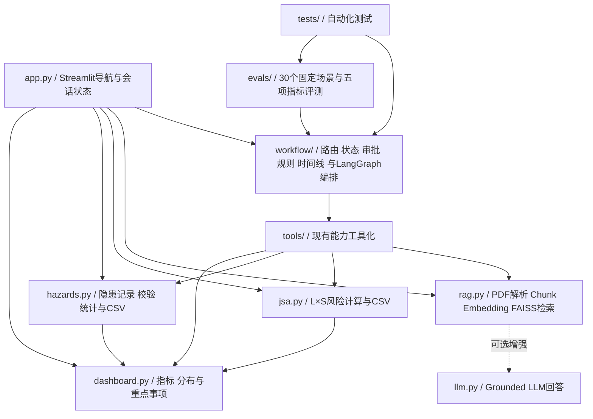

# EHS Copilot

## AI辅助EHS风险与危化品管理平台

面向制造业EHS场景的轻量数字化原型，集成SDS语义检索、JSA风险评估、隐患整改闭环、EHS数据看板，以及V3的AI工作流编排层。

> **本项目是面向真实 EHS 业务流程设计的 AI 工作流原型，不是已在真实企业生产环境部署的系统。**
>
> 它演示的是「一条自然语言任务如何被安全地拆解、执行、复核并留痕」，而不是一个可以直接投产、交由现场使用的产品。所有 SDS、JSA、隐患数据均为模拟数据，任何输出都不得用于真实安全决策。

## 在线体验

**Live Demo：** <https://ehs-copilot-zgiwyfrlcygmh58qcjp6lb.streamlit.app/>

公开Demo无需API Key。首次打开时会自动加载仓库内置的中英双语Synthetic SDS；访客也可以上传自己的多份可复制文本PDF。

## V3 要解决的业务问题

V1/V2 把 EHS 的几件事做成了独立功能页，但真实的 EHS 工作并不是按功能页发生的。现场 EHS 工程师手里拿到的是**一句话**：

> 「查询该 SDS 中关于 PPE 的要求，并为该作业做 JSA 风险评估，同时新增一条隐患：现场堆放杂物」

在 V2 里，这句话要人工拆成三次操作、切换三个页面；而且整个过程中没有任何机制回答下面三个问题：

1. **AI 到底做了什么？** 只看到最终结果，看不到识别、计划、工具调用与证据来源。
2. **AI 有没有越权？** 隐患台账是真实业务数据。模型一旦自己决定写入，没有任何拦截点。
3. **AI 说的能不能核对？** SDS 结论如果不附文件名、页码和原文，就无法与原始 SDS 逐条核对——在 EHS 场景里这等同于不可用。

所以 V3 不是「再加一个页面」，而是给已有的四项能力套上一层**可编排、可拦截、可复核、可留痕**的工作流外壳：统一任务入口、LangGraph 状态机、工具调用、人工审批门、安全规则与执行时间线。

## EHS Copilot V2 vs V3

| 维度 | V2 | V3 |
| --- | --- | --- |
| 入口 | 四个独立功能页，人工选页 | 一句自然语言统一入口（原四页全部保留） |
| 编排 | 无，各页逻辑互不相通 | LangGraph 状态机：`route → plan → guard_plan → tools → screen_evidence → summarize` |
| 任务识别 | 无 | 规则路由识别 SDS 查询 / JSA 风险评估 / 隐患管理 / 仪表盘汇总及其组合 |
| 能力复用 | 页面内直接调用 `rag` / `jsa` / `hazards` / `dashboard` | 同一批逻辑包成 6 个工具，页面与工作流共用同一实现 |
| 写操作 | 表单直接提交 | 必须在工具执行**之前**通过人工审批门 |
| SDS 结论 | 返回证据，但不强制 | 文件名 / 页码 / 原文缺任一项即暂停；无人确认时一律阻断 |
| 风险分值 | 由 `jsa.calculate_risk` 计算 | 同左，且**复算校验**工具返回的分值，不一致即丢弃 |
| 过程可见性 | 无 | 执行步骤表 + 执行时间线 |
| 评测 | 无 | 30 个固定场景、5 项可量化指标（`evals/`） |

## 核心功能

### 1. SDS智能检索

- 构建多PDF SDS知识库；
- 支持中文、英文自然语言查询；
- 覆盖危险性、PPE、储存、急救、泄漏及消防场景；
- 使用HuggingFace Embeddings与FAISS进行语义检索；
- 显示来源文件、PDF物理页码和原文证据；
- 证据不足时明确提示当前SDS知识库中未找到相关信息。

### 2. JSA风险评估

- 记录作业步骤、危险源、可能后果及控制措施；
- 按 `R = L × S` 计算初始风险和残余风险；
- 显示低、中、高、重大四级风险；
- 支持当前会话内多条记录管理、删除、清空及CSV导出。

### 3. 隐患整改管理

- 新增、编辑和删除隐患记录；
- 记录风险等级、责任人、发现日期、整改期限及整改措施；
- 管理待整改、整改中、已关闭三种状态；
- 自动计算整改完成率并支持CSV导出；
- 内置8条明确标注的模拟EHS隐患数据用于功能演示。

### 4. EHS仪表盘

- 汇总JSA高/重大风险数量、JSA记录总数和隐患总数；
- 显示待整改、已关闭数量及整改完成率；
- 展示JSA风险、隐患风险、隐患类型和整改状态分布；
- 列出少量高/重大风险JSA及高/重大且未关闭隐患；
- 直接读取JSA与隐患模块的当前会话数据，页面刷新后同步变化。

### 5. AI工作流助手（V3）

- 统一任务入口：用一句自然语言描述任务，无需先选功能页；
- LangGraph 状态机编排：`route → plan → guard_plan → tools → screen_evidence → summarize`；
- 规则路由识别 SDS 查询、JSA 风险评估、隐患管理、仪表盘汇总及它们的组合任务；
- 将现有能力工具化为 `search_sds`、`calculate_risk`、`draft_jsa`、`create_hazard`、`update_hazard`、`get_dashboard_summary`；
- 页面完整展示：识别出的任务类型、计划调用的工具、当前执行步骤、工具执行结果与最终回答；
- 自动生成的 JSA 与隐患记录会写回当前会话，与对应页面实时一致（均标注为草稿，需人工确认）。

#### 5.1 Human-in-the-loop（人工确认）

使用 LangGraph 原生 `interrupt()` + Checkpointer：需要确认时图会**暂停并落检查点**，暂停点之前的节点不会重跑，因此写操作绝不可能执行两次。

以下操作必须暂停等待人工确认：

- 创建隐患、修改隐患、关闭隐患；
- 涉及重大风险的写操作；
- AI 建议降低风险等级；
- SDS 证据不足或来源冲突时继续使用结论。

操作员可以 **批准** / **修改参数后批准** / **拒绝**：

- 批准 → 用原参数继续；
- 修改 → 用修改后的参数继续（只能改参数，不能换工具；任何会把重大风险、降低风险等级、关闭隐患等**新审批项**引入的修改会被按拒绝处理，需重新发起任务）；
- 拒绝 → 流程立即停止，不执行任何工具调用。

> 说明：`run_workflow()` 的 `auto_approve` 默认为 `True`，用于保持第一阶段的程序化调用语义；**Streamlit 页面始终传 `auto_approve=False`**，即真实使用路径一定经过人工审批。

#### 5.2 Guardrail（安全规则）

| 规则 | 等级 | 说明 |
| --- | --- | --- |
| SDS 结论必须有文件名、页码与原文证据 | 需审批 | 缺任一项即暂停；无人确认时一律阻断 |
| 风险分值必须由现有代码计算 | 阻断 | 计划不得携带预置分值，返回的分值会用 `jsa.calculate_risk` 复算（含残余风险），不一致即丢弃 |
| 化学品与 SDS 不匹配 | 阻断 | 问题点名的化学品不在已加载 SDS 覆盖范围内时，停止该 SDS 结论 |
| SDS 来源冲突 | 需审批 | 同一章节命中多个不同来源文件时必须人工确认以哪份为准 |
| 写操作必须经过审批 | 需审批 | 见 5.1 |
| 紧急事件必须遵循企业应急预案 | 提示 | 识别到进行中的泄漏/火灾/中毒等事件时，提示按应急预案与专业人员指挥处置并拨打 119/120 |

#### 5.3 执行时间线（Workflow Timeline）

页面以时间线呈现：已识别任务 → 已生成计划 → 等待审批 / 已批准 / 已拒绝 → 已调用工具 → 已获取证据 → 当前风险等级 → 已生成 JSA → 已执行写操作 → 已完成。暂停时「等待审批」始终是最后一个事件；被拒绝/被阻断时终点会标注为对应状态。

时间线不是靠副作用累积的，而是由 `timeline.py` 从图状态**确定性重建**：同一份状态永远渲染出同一条时间线。

#### 5.4 Tool Calling（工具调用）

路由把任务翻译成一个有序的工具计划，`ToolNode` 负责执行。工具层只是**薄包装**——算术、校验、聚合等业务逻辑全部留在原有模块里，不复制第二份：

| 工具 | 作用 | 复用的既有代码 |
| --- | --- | --- |
| `search_sds` | 从当前会话的 SDS 知识库检索，返回回答、来源与证据片段 | `rag.retrieve_documents` / `rag.answer_question` / `rag.collect_sources` |
| `calculate_risk` | 按 `R = L × S` 计算风险值与等级 | `jsa.calculate_risk` |
| `draft_jsa` | 生成一条 JSA 记录并写入当前会话 | `jsa.create_jsa_record` / `jsa.calculate_jsa_record_risks` |
| `create_hazard` | 新增隐患并写入隐患台账 | `hazards.create_hazard_record` / `hazards.next_hazard_id` |
| `update_hazard` | 按编号更新隐患字段 | `hazards.update_hazard_record` |
| `get_dashboard_summary` | 汇总指标、风险分布与重点关注事项 | `dashboard.*` / `hazards.calculate_hazard_summary` |

三条工程约束：

- **工具永不抛异常**。所有工具统一返回 `{status: ok | blocked | error}`，单个工具失败不会中断整条工作流；
- **会话上下文通过 `contextvars` 传递**，而不是塞进图状态（避免把 FAISS 向量库序列化进 state）；
- **安全规则不自己算分**，风险分值一律由 `jsa.calculate_risk` 产生，再用同一个函数复算校验。

#### 5.5 Agent 工作流：一个完整例子

以「新增一条隐患：配电箱前堆放杂物，风险等级高，责任人张三」为例（Streamlit 页面路径，`auto_approve=False`）：

1. **route** — 识别为「隐患管理」，抽取风险等级=高、责任人=张三、隐患类型=电气安全；
2. **plan** — 计划调用 `create_hazard`，并给出调用理由；
3. **guard_plan** — 命中「写操作必须经过审批」，图**在此暂停并落检查点**。此时隐患台账**一条都没变**；
4. 审批面板展示 待确认操作 / 触发原因 / 命中规则 / 拟执行内容 / 变更前 / 变更后，操作员选择 ✅批准、✏️修改参数后批准 或 ⛔拒绝；
5. **tools** — 批准后 `create_hazard` 才真正执行，写入 `HZ-001`；
6. **screen_evidence** — 复核本次工具返回值（风险分值复算校验等）；
7. **summarize** — 汇总回答，附人工审批记录与安全规则命中情况。

如果第 4 步选择拒绝：流程直接跳到 `summarize`，**不执行任何工具调用、不写入任何记录**，时间线以「已拒绝」收尾。

#### 5.6 AI 负责什么 / 人负责什么

| 环节 | AI 负责 | 人负责 |
| --- | --- | --- |
| 任务理解 | 识别任务类型、抽取参数、生成工具计划 | 在审批面板确认计划是否符合现场实际 |
| 信息检索 | 从 SDS 知识库检索，并给出文件名 / 页码 / 原文 | 与原始 SDS（含纸质版）逐条核对 |
| 风险计算 | 按 `R = L × S` 计算并复算校验分值 | 确认 L 与 S 的取值是否反映真实作业条件 |
| 写操作 | 仅在获得批准后执行写入 | 决定批准 / 修改参数 / 拒绝；对写入结果负责 |
| 风险等级变更 | 只提示「降级需要审批」 | 决定是否接受降级——AI 无权自行降低风险等级 |
| 紧急事件 | 只提示遵循企业应急预案，**不提供现场应急决策** | 现场指挥、疏散、隔离、报警与处置，全部由人完成 |
| 责任归属 | 提供可追溯的识别过程、证据与审批留痕 | 承担全部 EHS 决策与合规责任 |

一句话概括：**AI 负责「把活干完并留下证据」，人负责「决定能不能干、以及后果」。**

## 评测（Evaluation）

指标不是手写的，而是由 `evals/evaluate.py` 实际运行得出：

- 数据集：`evals/dataset.jsonl` — 30 个固定场景
- 运行结果：`evals/results.json`（原始）、`evals/RESULTS.md`（可读报告）

```powershell
python evals/evaluate.py
```

30 个场景覆盖 8 类：`sds_query`(4)、`jsa_risk`(4)、`hazard_write`(9)、`dashboard`(3)、`combined`(3)、`emergency`(2)、`evidence_gap`(3)、`chemical_mismatch`(2)。**所有场景都走 `auto_approve=False` 的交互式真实路径**（必须经过人工审批门），并分别施加 批准 / 修改参数 / 拒绝 / 不作决策 四种处置。

实测结果（2026-09-12 运行，检索直出模式、无 LLM 密钥、离线可复现）：

| 指标 | 结果 | 定义 |
| --- | --- | --- |
| Routing Accuracy | **100.0%**（30/30） | 识别出的任务类型与预期完全一致 |
| Tool Call Accuracy | **100.0%**（30/30） | **计划**与**实际执行**的工具序列均与预期一致 |
| Citation Coverage | **85.7%**（6/7） | 已交付的 SDS 结论中，文件名+页码+原文完整可追溯的比例（分母含 1 条人工放行例外，分解见下） |
| Approval Compliance | **100.0%**（148/148） | 全部审批不变式通过的比例 |
| Workflow Completion | **100.0%**（30/30） | 结束状态与预期一致 |

### Citation Coverage 为什么是 85.7%（6/7）

与 SDS 结论相关的场景共 **12** 条，数字关系如下：

| 项目 | 数量 | 说明 |
| --- | --- | --- |
| SDS 相关场景合计 | **12** | `sds_query`(4) + `combined` 中带 SDS 的(2) + `evidence_gap`(3) + `chemical_mismatch`(2) + `emergency` 中带 SDS 的(1) |
| 被 Guardrail 正确阻断、**未交付** | **5** | 证据不足（`ev-01`）、来源冲突（`ev-03`）、化学品不匹配（`mm-01`/`mm-02`）、紧急事件叠加不匹配（`emg-02`） |
| 实际**交付**给用户 | **7** | ← 主指标**分母** |
| 其中：具备完整「文件名 + 页码 + 原文」证据 | **6** | ← 主指标**分子** |
| 其中：证据缺页码、经人工确认后继续 | **1** | `ev-02`，交付了但**不可机器追溯** |

- 因此 **Citation Coverage = 6 / 7 = 85.7%**。分母是**全部已交付结论**，人工放行的例外不剔除。
- 自动交付（不依赖人工放行的 6 条）场景的引用覆盖率**单独报告**为 **6 / 6 = 100.0%**；该口径**不并入**主指标：

| 口径 | 结果 | 分子 / 分母含义 |
| --- | --- | --- |
| 全部已交付结论（**主指标**） | **85.7%**（6/7） | 分母含 1 条人工放行例外 |
| 自动交付场景（**单独报告**） | **100.0%**（6/6） | 不依赖人工放行，逐条机器可追溯 |

- 另有 **5/5** 条 SDS 结论被 Guardrail 正确拦截，未交付给用户。

> **这两个数字都不得通过排除失败样本、剔除人工放行样本、或放宽任何 Guardrail 来美化。**
> 一旦把 `ev-02` 剔出分母，主指标就会虚高到 100%——而这正是该指标存在的意义：
> 它衡量的是「交给用户的东西里，有多少能被机器独立核对」，所以人工例外**必须**压低它。
> 上述约束由 `tests/test_evaluation.py::test_the_human_override_is_never_excluded_from_the_headline` 锁定，
> 一旦有人试图用剔除样本的方式抬高指标，测试会失败。

审批不变式共 148 条，覆盖：写操作必须有人工审批记录（自动放行不算）、暂停必须发生在任何记录变更之前、被拦截的操作与审批门必须与预期一致、拒绝后必须零写入、修改后的参数必须被实际采用、会引入新审批项的修改必须被按拒绝处理、未获决策时必须保持挂起。

**这些数字应该怎么读**（重要）：

- 数据集与代码由同一作者编写，属于 **in-sample 回归基线**。它证明的是「既定设计行为没有被破坏」，**不是**独立泛化能力。规则式路由对措辞敏感，数据集之外的输入会失败，实例见「项目限制」。
- **Citation Coverage 未达 100% 是保留的真实结果，不是缺陷、也没有被美化**。唯一未计入分子的是 `ev-02`：它证据缺页码，经人工确认后交付，因此留在分母而不计入分子。要同时看两个口径——**主指标 6/7 = 85.7%**（全部交付）与**单独报告 6/6 = 100.0%**（自动交付）。前者回答「交给用户的东西有多少能被机器核对」，后者回答「不靠人兜底时系统自己有多可靠」。**不得靠排除失败样本或放宽安全规则把前者抬到 100%。**
- 评测在无 LLM 密钥时运行，SDS 回答走检索直出路径，结果可复现。若配置了 API Key，回答改由 LLM 生成，指标会随模型波动。

## 技术栈

- Python
- Streamlit
- HuggingFace Embeddings / Sentence Transformers
- FAISS
- LangChain
- LangGraph（V3 工作流编排）
- pypdf
- OpenAI-compatible Chat API（可选）

## 项目架构



`workflow/` 内部结构：

| 模块 | 职责 |
| --- | --- |
| `router.py` | 规则路由：任务识别、参数抽取、工具计划 |
| `state.py` | 图状态与结果对象（含审批、规则命中、时间线） |
| `hitl.py` | 审批请求/决策对象（批准 / 修改 / 拒绝） |
| `guardrails.py` | 纯函数式安全规则（证据、分值、化学品、紧急事件） |
| `timeline.py` | 由状态派生的执行时间线 |
| `graph.py` | LangGraph 编排与 `interrupt()` 暂停/恢复 |
| `summary.py` | 确定性回答合成 |
| `ui.py` | 「AI 工作流助手」页面 |

工具层只是薄包装：风险计算、记录校验、指标聚合等业务逻辑仍保留在 `jsa.py`、`hazards.py`、`dashboard.py`、`rag.py` 中，`workflow/` 与 `tools/` 不复制这些逻辑。安全规则也**不自己算分**——风险分值一律由 `jsa.calculate_risk` 产生，再用同一函数复算校验。

核心业务数据仅保存在当前Streamlit会话中，不使用数据库。Dashboard直接读取 `jsa_records` 和 `hazard_records`，不维护独立副本。

## 本地运行

```powershell
git clone https://github.com/qingxiangliu85-netizen/ehs-copilot.git
cd ehs-copilot
python -m venv .venv
.\.venv\Scripts\Activate.ps1
python -m pip install -r requirements.txt
python -m streamlit run app.py
```

浏览器访问：<http://localhost:8501/>

首次构建SDS知识库时需要从HuggingFace下载Embedding模型，冷启动时间取决于网络和本地缓存。

## Optional LLM Enhancement

默认公开Demo使用免费SDS检索模式，不需要API Key。若需要本地启用基于检索证据的LLM回答，可将 `.env.example` 复制为 `.env`：

```dotenv
OPENAI_API_KEY=your-api-key-here
OPENAI_BASE_URL=
OPENAI_MODEL=gpt-4o-mini
```

`.env` 已被Git忽略。禁止将真实密钥提交到仓库、README或日志。

## 测试

```powershell
python -m unittest discover -s tests -p "test_*.py" -v
```

当前 **117/117 passed**，覆盖：

- V2 原有：SDS/RAG、Demo 体验、JSA、隐患整改、仪表盘（24）
- V3 第一阶段：工作流路由、工具调用、LangGraph 编排、新页面（28）
- V3 第二阶段：Human-in-the-loop、Guardrail、执行时间线（39）
- V3 第三阶段：评测数据集结构、五项指标算法、审批不变式、评测程序端到端，以及「引用覆盖率不得靠剔除人工放行样本来抬高」的不变式（26）

评测程序单独运行：

```powershell
python evals/evaluate.py
```

测试和 Demo 中的 SDS、JSA 及隐患数据均为模拟数据，不代表真实企业记录或真实作业 SOP。

## Streamlit Community Cloud部署

1. 将仓库推送至GitHub；
2. 在Streamlit Community Cloud创建应用并选择该仓库；
3. Main file path填写 `app.py`；
4. 默认免费检索模式无需配置Secrets，重新部署即可。

## 项目限制

### 定位限制

- **未在生产环境部署**。本项目没有部署到任何真实企业环境，没有经过真实业务流量验证，没有真实 EHS 部门用过。
- **无持久化**。所有记录保存在 Streamlit 会话状态中，刷新即丢失。LangGraph 的检查点也是内存级 `MemorySaver`——进程重启后，暂停中的审批即失效。
- **无鉴权、无多租户、无审计日志落库、无备份**，不满足企业合规要求。
- **单实例、单进程、内存级 FAISS 索引**，没有并发与容量设计。

### 能力限制

- **路由是规则式的，对措辞敏感**。以下是 `evals/` 数据集之外的留出输入，实测结果：
  - `今天有几个隐患要到期` → 被规划为 `create_hazard`（本应是只读汇总）。**这是真实缺陷**：`几个` 不在只读提示词表内，读问题被误判成写计划。它被审批门拦住了，不会真的写入，但计划本身是错的。
  - `把 HZ-001 关掉`、`帮我评估一下这个作业的风险`、`检查一下配电箱`、`危险源辨识怎么做` → 均未识别出任务类型。
  - 结论：路由准确率对**数据集内**的措辞有效；换一种说法就可能失效。这也是把 `Routing Accuracy` 明确定义为 in-sample 回归基线的原因。
- **参数抽取同样是规则式的**。例如「为该作业做 JSA 风险评估」这种没有具体作业名称的表述，生成的 JSA「作业名称」会退化成「该作业」，需要人工在审批环节修正。
- **SDS 只会回答它所描述的化学品**，不做跨化学品外推。问题点名的化学品不在已加载 SDS 范围内时直接阻断——Demo 仓库里只有 DX-01 一份 SDS，所以问「浓硫酸」「甲苯」都会被拦下，这是设计行为而非误报。
- **评测运行在检索直出模式**。配置 API Key 后 SDS 回答改由 LLM 生成，措辞不再可复现，评测指标也会随模型波动。
- **没有 Ragas 式的检索质量 / 忠实度评测**；也**没有多轮对话记忆**，每次运行都是单轮。
- 已知技术债：`use_container_width` 已被 Streamlit 标记 2025-12-31 后移除（页面仍在使用）；`rag.py` 仍从 `langchain-community` 导入 FAISS，该包已进入 sunset。

### 未实现

多 Agent / Supervisor 编排、Ragas 评测、SQLite 持久化、FastAPI / React 前后端分离、n8n 集成。

## Disclaimer

本项目是EHS数字化原型及求职展示项目，不是企业生产级EHS系统。

- 示例SDS、JSA和隐患记录均为模拟数据；
- AI或语义检索结果不构成安全操作指令或自动决策；
- 本工具不替代企业制度、SOP、原始SDS、现场风险评估及专业人员判断；
- 实际作业、风险分级和整改措施必须依据适用法规、企业制度及现场条件确定；
- 请勿上传企业内部资料、员工个人信息或其他受限文件；
- `evals/` 中的评测数字只描述本项目固定数据集上的行为，**不构成任何安全性能保证**。

**This project is an AI-assisted EHS information retrieval and management prototype. It does not replace original SDS documents, site-specific procedures, workplace risk assessments, or professional EHS judgment.**

## License

项目自有代码采用 [MIT License](LICENSE)。第三方依赖受各自许可证约束，详见 [THIRD_PARTY_NOTICES.md](THIRD_PARTY_NOTICES.md)。
